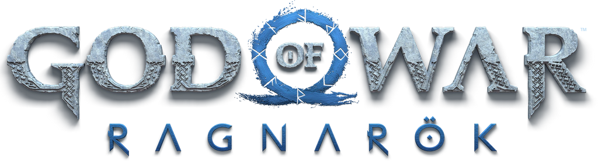

<a name="readme-top">

<br/>

<br />
<div align="center">
  <a href="https://github.com/zyx-0314/">
  <!-- TODO: If you want to add logo or banner you can add it here -->
    
  </a>
<!-- TODO: Change Title to the name of the title of your Project -->
  <h3 align="center">God of War: Ragnarok Themed Project</h3>
</div>
<!-- TODO: Make a short description -->
<div align="center">
  (AD-Task-1)
</div>

<br />

<!-- TODO: Change the zyx-0314 into your github username  -->
<!-- TODO: Change the WD-Template-Project into the same name of your folder -->


[](https://wakatime.com/badge/user/018ee989-e542-4dcd-a299-7e936489a16f/project/a496fdba-2b5e-476d-95b2-4c2d2e75dd46)

---

<br />
<br />

<!-- TODO: If you want to add more layers for your readme -->
<details>
  <summary>Table of Contents</summary>
  <ol>
    <li>
      <a href="#overview">Overview</a>
      <ol>
        <li>
          <a href="#key-components">Key Components</a>
        </li>
        <li>
          <a href="#technology">Technology</a>
        </li>
      </ol>
    </li>
    <li>
      <a href="#rule,-practices-and-principles">Rules, Practices and Principles</a>
    </li>
    <li>
      <a href="#resources">Resources</a>
    </li>
  </ol>
</details>

---

## Overview

<!-- TODO: To be changed -->
<!-- The following are just sample -->

Welcome to the **God of War: Ragnarok Themed Project**, a website that demonstrates the basics of programming with the aesthetic and design from God of War: Ragnarok.

### Key Components

<!-- TODO: List of Key Components -->
<!-- The following are just sample -->

- **Dynamic Header & Footer**
- **Styled Buttons & Navigation**
- **Declaration, Conditional, and Loop Code**

### Technology

<!-- TODO: List of Technology Used -->
#### Language


#### Framework/Library


#### Databases


#### Deployment


## Rules, Practices and Principles

<!-- Do not Change this -->

1. Always use `AD-` in the front of the Title of the Project for the Subject followed by your custom naming.
2. Do not rename `.php` files if they are pages; always use `index.php` as the filename.
3. Add `.component` to the `.php` files if they are components code; example: `footer.component.php`.
4. Add `.util` to the `.php` files if they are utility codes; example: `account.util.php`.
5. Place Files in their respective folders.
6. Different file naming Cases
   | Naming Case | Type of code         | Example                           |
   | ----------- | -------------------- | --------------------------------- |
   | Pascal      | Utility              | Accoun.util.php                   |
   | Camel       | Components and Pages | index.php or footer.component.php |
8. Renaming of Pages folder names are a must, and relates to what it is doing or data it holding.
9. Use proper label in your github commits: `feat`, `fix`, `refactor` and `docs`
10. File Structure to follow below.

```
AD-Task-1/
├── assets/
│   ├── css/
│   │   ├── styles.css  (Norse styling)
│   ├── img/
│   │   ├── gow-logo.png  (Game logo)
│   │   ├── midgard.jpg  (Homepage background)
│   │   ├── asgard.jpg  (Journey page background)
│   │   ├── kratos.png  (Kratos standing image)
│   │   ├── atreus.png  (Atreus standing image)
│   ├── js/
├── components/
│   ├── header.php  (Displays the logo and navigation)
│   ├── footer.php  (Page footer with copyright details)
├── pages/
│   ├── assets/
│   │   ├── css/
│   │   ├── img/
│   │   ├── js/
│   ├── index.php  (Journey Page)
├── utils/
├── vendor
├── .gitignore
├── bootstrap.php
├── composer.json
├── composer.lock
├── index.php  (Homepage)
├── readme.md  (This file)
├── router.php
```
> The following should be renamed: name.css, name.js, name.jpeg/.jpg/.webp/.png, name.component.php(but not the part of the `component.php`), Name.utils.php(but not the part of the `utils.php`)

## Resources

<!-- TODO: Add References -->

| Title        | Purpose                                                                       | Link          |
| ------------ | ----------------------------------------------------------------------------- | ------------- |
| Sample Title | Sample purpose would be here like this and this is the example of what it is. | trykolang.com |
| Sample Title | Sample purpose would be here like this and this is the example of what it is. | trykolang.com |
| Sample Title | Sample purpose would be here like this and this is the example of what it is. | trykolang.com |
| Sample Title | Sample purpose would be here like this and this is the example of what it is. | trykolang.com |
